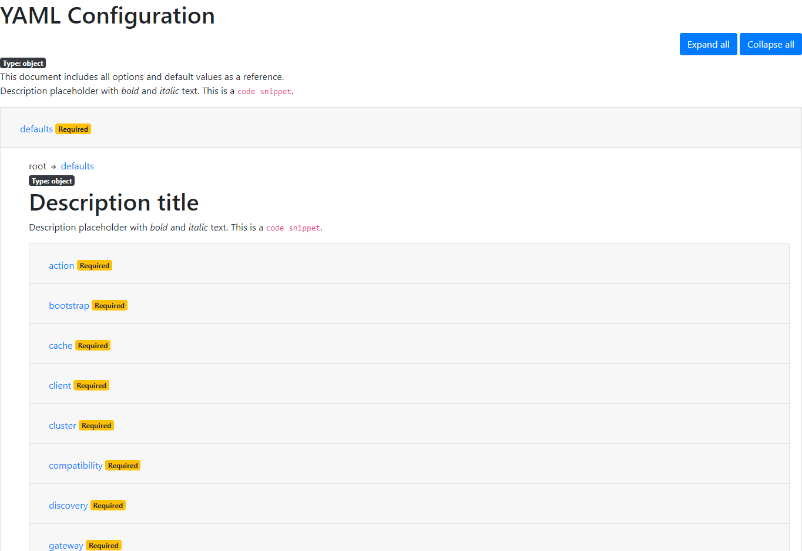

# YAML Configuration Documentation

tl;dr: JavaDoc or doxygen for YAML.

A naive approach to generate documentation from YAML files which can be integrated into CI-CD pipeline.

The `defaults.yml` file used as an example is extracted from OpenSearch configuration.

## Usage

* Run `git clone https://github.com/zbalkan/yaml-docs.git` to clone the repository.
* Copy the YAML file under `input/` directory or any other place if you change the `configuration.py`.
* Update `configuration.py` based on your requirements.
* Run `pip install -r requirements.txt`
* Run `python3 doc_generator.py -h` to get help.
* PROFIT

```bash
usage: doc_generator.py [-h] [-p] [-s] [-d]

Generate HTML documentation for YAML files.

options:
  -h, --help     show this help message and exit
  -p, --preview  Generates documentation from YAML with description placeholders.
  -s, --schema   Generates schema from YAML with description placeholders.
  -d, --docs     Generates documentation from schema.
```

## Generated docs

The documentation is under `./output` directory. Under screenshots, ou can get both partial and full views.

The script keeps generated JSON schema on disk in case you want to utilize it for any kind of reason, like schema validation for your YAML file.



## Reference

The POC is based on the ideas in the issue [214](https://github.com/opensearch-project/documentation-website/issues/214)
